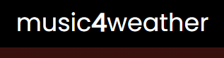

# Music4Weather


<br/>



<br/>
<br/>

> Projeto desenvolvido para o desafio fullstack Aliare.

<br/>

## Tecnologias Utilizadas

<code></code>
<code></code>
<code></code>
<code></code>
<code></code>

<br/>

## Requisitos

Antes de começar, tenha certeza de atender os seguintes requisitos:
* Node versão 14.17.6 ou maior;
* NPM ou Yarn;
* Git.

<br/>

## Como Iniciar

Para iniciar o projeto, siga os seguintes passos:

Vá para o diretório no qual deseja clonar o projeto e execute:
```
git clone https://github.com/alaodev/music4weather-client.git
```

Então: 
```
cd music4weather-client
```

Agora:
```
yarn ou npm i // Para instalar as dependências.
```

Finalmente:
```
npm run dev
```

Por padrão a aplicação irá iniciar na porta 3000.


[⬆ Voltar para o topo](#nlw_heat_node)<br>
